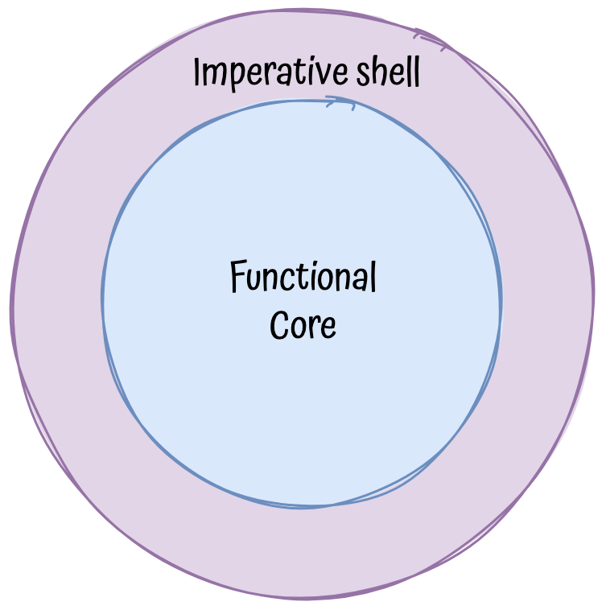

# Todo app with Functional-core, Imperative-shell architecture

## Overview

Functional-core, Imperative-shell architecture is a design pattern that separates the business logic from the presentation logic.

The business logic is implemented in a pure function(without side effects). The presentation logic is implemented in an imperative function(db calls, http requests, etc.) and wrap the pure function.



## Setup

```bash
npm install
npm start
```

## Endpoints

### GET /todos
- Returns all todos

Search params -
- completed: boolean
- title: string

### POST /todos
- Creates a new todo

### PATCH /todos/:id/toggle
- Toggles a todo

### DELETE /todos/:id
- Deletes a todo